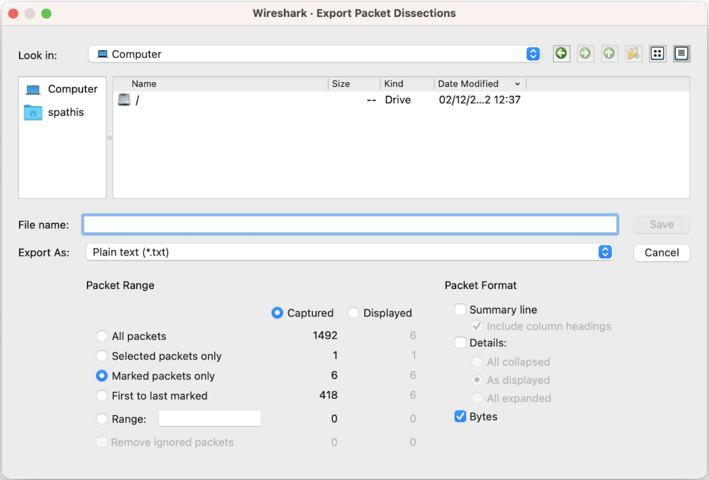

# Welcome to Sniffsift!
                             ____________________________
                            /  _________________________ \
                            | | C:\> ./sniffsift       | |
    ,-.___,-.               | |                        | |
    \_/_ _\_/               | | +_+ hello              | |
      )O_O(                 | | I've been alone with   | |
     { (_) } sniff! sniff!  | | you inside my mind ... | |
      `-^-'                 | |                        | |
                            | |________________________| |
                            \____________________________/

 

## About the project:

SniffSift is an offline network traffic analyzer. The input of the analyzer is a hex dump text file containing the bytes of multiple packets captured on an Ethernet link. It can run in a terminal (i.e., command-line prompt). The list of protocols that the analyzer is able to decode are the following:

- Layer 2: Ethernet
- Layer 3: IP
- Layer 4: UDP
- Layer 7: DNS and DHCP

After running the program, the user is be able to save the output of the analyzer in a text file using the `save` command. The text file is formatted to ease the readability of the output. 

 

## The input:

You can find an example of the plain text hex dump input to this prorgam in the `test.txt` file. You can also test the program with your own hex dumps! You can export hex dumps to test the program using Wireshark as follows:

1. Select / Mark the packets to export in the Packet pane (right-click or Edit menu).
2. Click in the File Menu > Export Packet Dissections > As Plain text… 
3. Select the packets to export (All packets, Selected packets only, Marked packets only, …)
4. Uncheck all boxes (Summary line, Details, ...) other than the Bytes box.
5. Fill the File name where to save the hex dump.
 
 

 

## The output:

The output of the program is similar to the information provided by Wireshark in the "Packet Details" Pane. The analyzer shows the list of all protocol headers for each DNS or DHCP packet inside the trace file. This output can be stored in a text file formatted to ease the readability of the output.
 

The output shows: 
 
A summary of each packet read using the `read` command. Upon using the `expand` command, for each protocol header, the name of the header fields and the value contained in these header fields in hexadecimal, and, if relevant, the decimal conversion of this value is displayed. 

### Example

#### Summary:

Ethernet II, Src: 00:14:0b:33:33:27, Dst: d0:7a:b5:96:cd:0a 
Internet Protocol Version 4, Src: 192.168.1.101, Dst: 67.252.131.62 
User Datagram Protocol, Src Port: 49690, Dst Port: 55645 
Data (56 bytes) 

#### Full packet:

Layer ETH: 
    Destination: d0:7a:b5:96:cd:0a  
    Address: d0:7a:b5:96:cd:0a  
    .... ..0. .... .... .... .... = LG bit: Globally unique address (factory default)  
    .... ...0 .... .... .... .... = IG bit: Individual address (unicast)  
    Source: 00:14:0b:33:33:27  
    .... ..0. .... .... .... .... = LG bit: Globally unique address (factory default)  
    .... ...0 .... .... .... .... = IG bit: Individual address (unicast)  
    Type: IPv4 (0x0800)  
    Address: 00:14:0b:33:33:27  

Layer IP: 
    0100 .... = Version: 4  
    .... 0101 = Header Length: 20 bytes (5)  
    Differentiated Services Field: 0x00 (DSCP: CS0, ECN: Not-ECT)  
    0000 00.. = Differentiated Services Codepoint: Default (0)  
    .... ..00 = Explicit Congestion Notification: Not ECN-Capable Transport (0)  
    Total Length: 84  
    Identification: 0x313a (12602)  
    000. .... = Flags: 0x0  
    0... .... = Reserved bit: Not set  
    .0.. .... = Don't fragment: Not set  
    ..0. .... = More fragments: Not set  
    ...0 0000 0000 0000 = Fragment Offset: 0  
    Time to Live: 128  
    Protocol: UDP (17)  
    Header Checksum: 0x8017 [validation disabled]  
    Header checksum status: Unverified  
    Source Address: 192.168.1.101  
    Destination Address: 67.252.131.62  

Layer UDP: 
    Source Port: 49690  
    Destination Port: 55645  
    Length: 64  
    Checksum: 0x1c25 [unverified]  
    Checksum Status: Unverified  
    Stream index: 3  
    Timestamps  
    Time since first frame: 0.000000000 seconds  
    Time since previous frame: 0.000000000 seconds  
    UDP payload (56 bytes)  

Data: 6000000000003b15200100009d386ab82428d67b3a62ffee200100009d3890d704d226a2bc037cc101043b6c533404040100000005027a96  
[Length: 6000000000003b15200100009d386ab82428d67b3a62ffee200100009d3890d704d226a2bc037cc101043b6c533404040100000005027a96] 

 

## Implementation

`cli_tool.py` is a command line tool that can take in user input, fetch and display packet data, and suggest to the user how to interpret the data. `read_packets.py` is a script that parses the hex dump to extract meaningful packet data. 

The workflow is simple:
hex dump plain text file --> pcap file --> list objects

The transition "hex dump plaintext file --> pcap" file takes place in `read_packets.py`. 

`read_packets.py` returns two lists:
- packet_summary: lst of lst of str (a summary of the layers of a packet)
- lst_layer: lst of lst of layer objets (the full string content of each layer in a Pyshark packet object)

 

The `cli_tool.py` file displays the packets read in `read_packets.py` via the `read` command. Check the help mannual by running `help <command_name>` once you have started the command line tool.

 

## Usage

1. To run the program use the following command `./cli_tool.py [.txt file]`. This will read the hex dump and print out the contents.
2. Run `filter` and then choose your desired filters to filter through different settings like IP addresses, port numbers, packet size, etc...
3. Run `protodist` to see the protocol breakdown of the packets including DNS, DHCP, and UDP

 

Type `help` to see all the available commands. For information on how to use a command, type `help <command>`.

 

### Available commands:

- `clear` to clear the screen

 

- `display {number of packets}` to show a summary of packets after filters have been applied. 

  `display` to display all filtered packets.

 

- `hello` for Karaoke!

 

- `menu` to display the functionalities of the program

 

- `read {your_hexdump_file.txt}` to read and parse the packets in a hex dump file

 

- `show {number of packets}` to show packets that have been read (non filtered output)

  `show` to show all packets.

 

- `clear_filter` to clear filters

 

- `expand {packet #}` to show the full contents of the packet specified

 

- `help` to list available commands with "help" or detailed help with "help cmd"

 

- `protodist` to show the protocol distribution

 

- `reset` to erase all stored packet information

 

- `top_talkers` to show the distribution of hosts sending packets

 

- `delayviz` to display a time-series graph of the delay of packets' arrival time between to hosts

 

- `filter` to filter packets based on source/destination parameters

 

- `ls` to list contents of current directory

 

- `q` to exit the CLI

 

- `save {"filter"} {"full"}` to save the summary of the packets in a text file

  `save filter` to save the filtered packets only

  `save full` to save all packets with all details

  `save filter full` to save full filtered packets

 

## Packages

Use pyshark Version: 0.4.3

Set up brew
- get rid of old wireshark. Delete app and run `brew uninstall --force wireshark` to be safe
- Install wireshark by running `brew install wireshark` and `brew install --cask wireshark`
- Check that it worked `brew info --cask wireshark`
- Add an alias to your path directory `alias wireshark='/Applications/Wireshark.app/Contents/MacOS/Wireshark'`
- Install Plotext by running  `pip install plotext`
